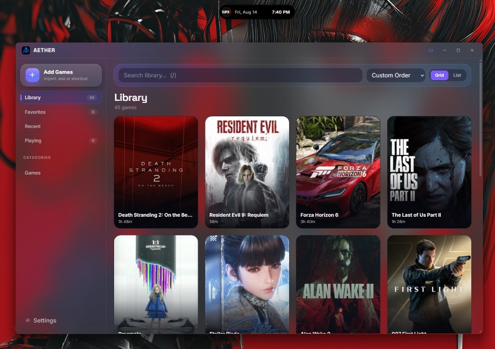

<p align="center">
  
</p>

<h1 align="center">Aether</h1>

<p align="center">
  Game launcher for Windows.<br>
  Full library in one window. A Dynamic Island on the desktop.
</p>

<p align="center">
  <a href="https://github.com/parsabahemmat/Aether/releases/latest"><strong>Download for Windows</strong></a>
  &nbsp;·&nbsp;
  <a href="https://github.com/parsabahemmat/Aether/releases/tag/v1.3.0">v1.3.0</a>
</p>

<p align="center">
  
</p>

---

Aether keeps your PC games in a local library with animated covers, playtime, and a redesigned detail page for each title. A compact island stays at the top of the screen so you can launch a game, skip a track, or check a notification without opening the main window.

Windows 10 and 11. Installs for the current user. The app runs elevated so Play can open games as administrator without a second UAC prompt when that option is on.

## What’s new in 1.3

- **SteamGridDB artwork** — browse grids, heroes, and icons from [SteamGridDB](https://www.steamgriddb.com/) and apply them in one click from the game page
- **Auto-fill on add** — when you add a game, Aether can fill empty cover, banner, and icon slots with the top SteamGridDB matches (anything you set later is left alone)
- **Built-in API access** — SteamGridDB credentials stay sealed inside the app; no key setup required in Settings

Earlier in 1.2: Steam launches via `steam://rungameid/…`, in-game overlay metrics (FPS / CPU / GPU / temps / VRAM), and per-session performance charts on the game page.

## Steam games

Add a Steam title the same way as any other game:

1. Browse to the game’s folder under `…\steamapps\common\…` and pick the main `.exe`, **or**
2. Add a Steam internet shortcut (`.url`) that points at `steam://rungameid/<id>`

Aether detects the AppID from `steam_appid.txt` or the nearby `appmanifest_*.acf`, tags the entry as **Steam**, and prefers the Steam display name when available.

**Play** opens the game through the Steam client. Keep Steam installed and signed in. Direct `.exe` spawns often exit immediately so Steam can relaunch the real process — Aether waits for that handoff and continues the same play session (overlay + playtime) instead of ending early.

> Tip: If a Steam game shows as missing, re-pick the `.exe` from its install folder. URI-only (`.url`) entries still launch, but folder reveal is hidden because there is no local path.

## Overlay & play sessions

In **Settings**, turn on the in-game overlay and choose which metrics to show. While a library game is running, the island widens into a live HUD (click-through so it does not steal input).

After you quit, open the game page for a **session teaser** and full results with performance charts. Sessions and playtime stay on your PC in `%APPDATA%\Aether`.

## Library

Add games by dropping `.exe`, `.lnk`, `.bat`, `.cmd`, or Steam `.url` files onto the window, or pick them from disk. Each entry can have a cover, banner, icon, tags, category, and notes.

On add, Aether can auto-fill empty artwork from SteamGridDB. From the game page, choose **SteamGridDB** or a local file when setting cover, banner, or icon — search a title, pick a grid/hero/icon, and it downloads into your library.

Covers accept still images, GIFs, and video. With [ffmpeg](https://ffmpeg.org/) on `PATH` (or `ffmpeg.exe` in `%APPDATA%\Aether\bin\`), GIF and video artwork is converted to VP9 WebM and plays while the tile is visible.

Playtime and launch count are stored on your machine. Search, favorites, and a custom sort order are included. If a Nebula library exists at `%APPDATA%\Nebula`, Aether imports it on first launch.

## Game page

Open a title for a cinematic banner, cover, play controls, about text, artwork section, screenshots, and recent session results. Press the gear or **Edit game** to change name, media, accent, launch args, and the executable. A configurable hotkey (default F9) captures into that game’s screenshot gallery.

## Island

A pill sits at the top center of the display. Hover to expand it: running and recent games, now-playing controls from Windows media sessions, and a short notification list. Clicks outside the island pass through to the desktop.

When overlay is enabled and a game is running, the island becomes the in-game metrics strip. It can stay above other windows and can be assigned to a specific monitor.

## Appearance

Pick a visual theme and window material (Acrylic, Mica, Tabbed, or solid). Accent color, reduced motion, launch on sign-in, start minimized, “run games as administrator,” and overlay toggles live in Settings.

## Install

1. Download [**Aether-Setup-1.3.0.exe**](https://github.com/parsabahemmat/Aether/releases/latest)
2. Run the installer (Windows may ask for administrator once)
3. Open **Aether** from the Start menu

The installer will set up [WebView2](https://developer.microsoft.com/microsoft-edge/webview2/) if it is missing. Library files live in `%APPDATA%\Aether`.

## Build from source

Rust (MSVC toolchain), Node 18+, and WebView2.

```bash
npm install
npm run tauri dev
```

Windows installer:

```powershell
powershell -ExecutionPolicy Bypass -File scripts/build-installer.ps1
```

## License

See [LICENSE.txt](LICENSE.txt). [Sponsor](https://github.com/sponsors/parsabahemmat)
